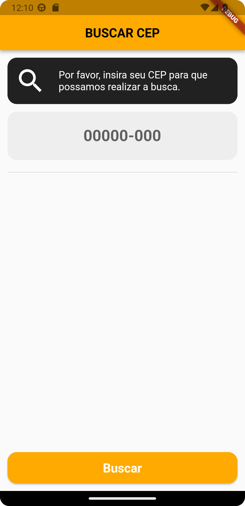
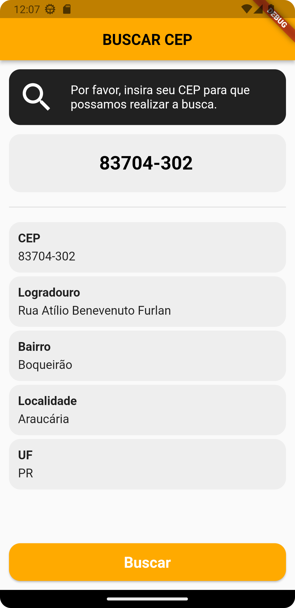

# search_cep

O projeto "Search CEP" é um aplicativo desenvolvido em Flutter que permite ao usuário inserir um CEP e obter alguns dados relacionados a esse endereço. O aplicativo utiliza a arquitetura de gerenciamento de estado Flutter_bloc e segue os princípios do Clean Code para garantir um código limpo e fácil de manter.

Ao abrir o aplicativo, o usuário é apresentado com uma tela de entrada onde pode inserir o CEP desejado. Ao inserir o CEP e pressionar o botão de consulta, o aplicativo faz uma solicitação HTTP para a API de consulta de CEPs fornecida pelo ViaCEP.

Após receber a resposta da API, o aplicativo utiliza o Flutter_bloc para gerenciar o estado da aplicação e atualizar a interface do usuário com os dados retornados pela API, incluindo o logradouro, bairro, cidade e estado correspondentes ao CEP inserido.

O projeto é implementado seguindo as diretrizes do Clean Code para garantir um código limpo, organizado e fácil de manter. Isso inclui a separação clara de responsabilidades em diferentes classes e métodos, bem como a utilização de boas práticas de nomenclatura, documentação e estruturação de código.

